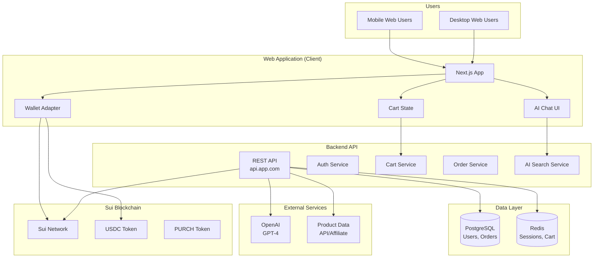
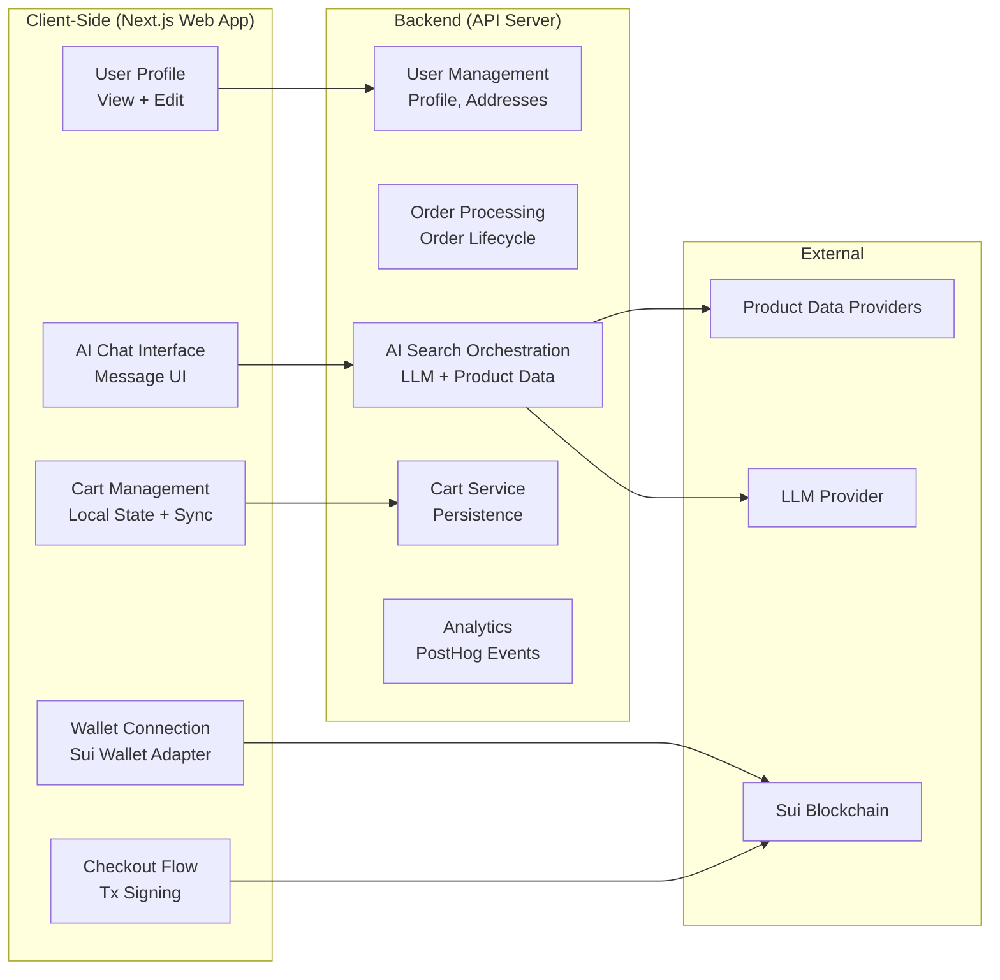
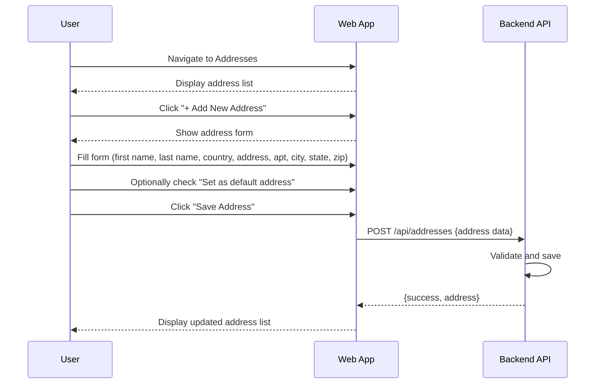
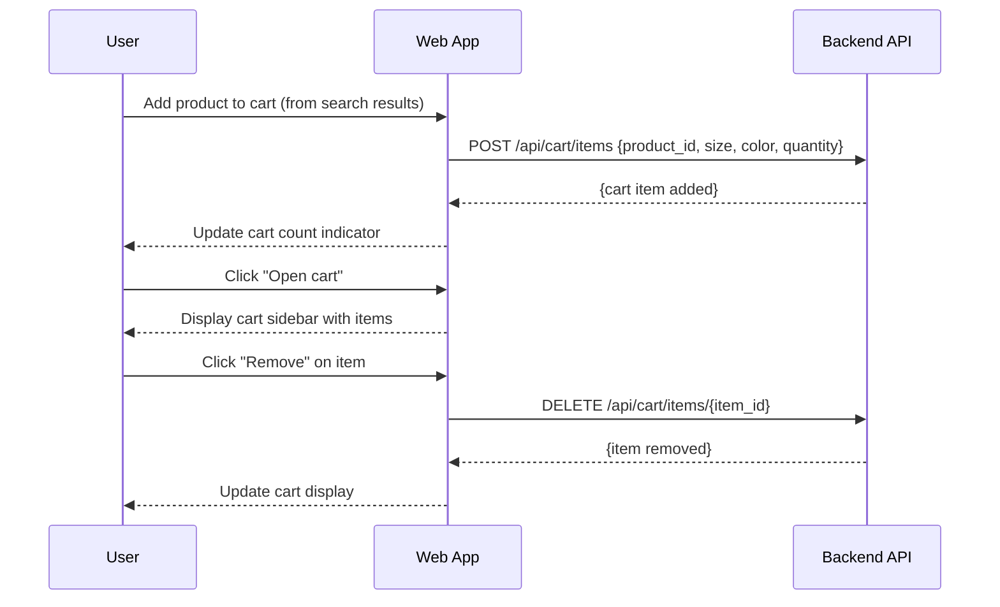
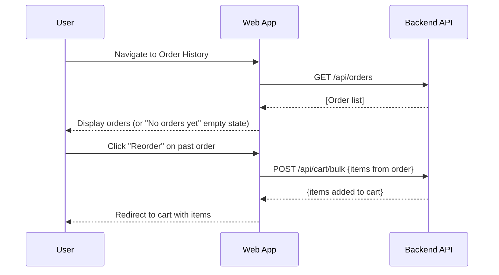
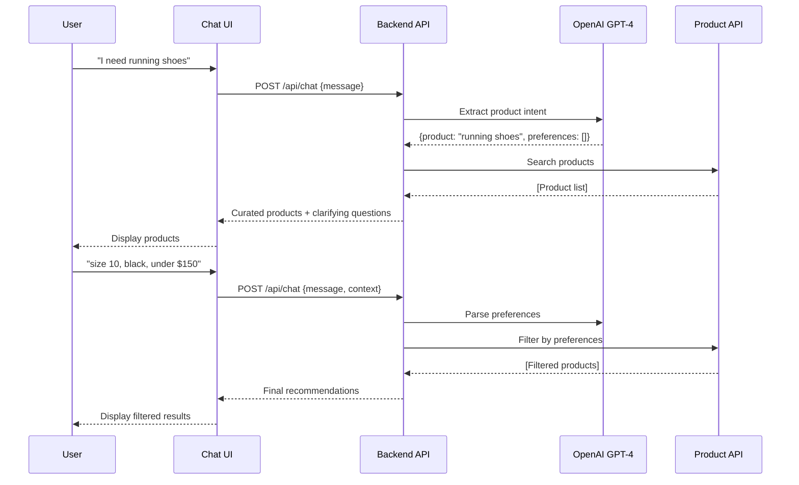
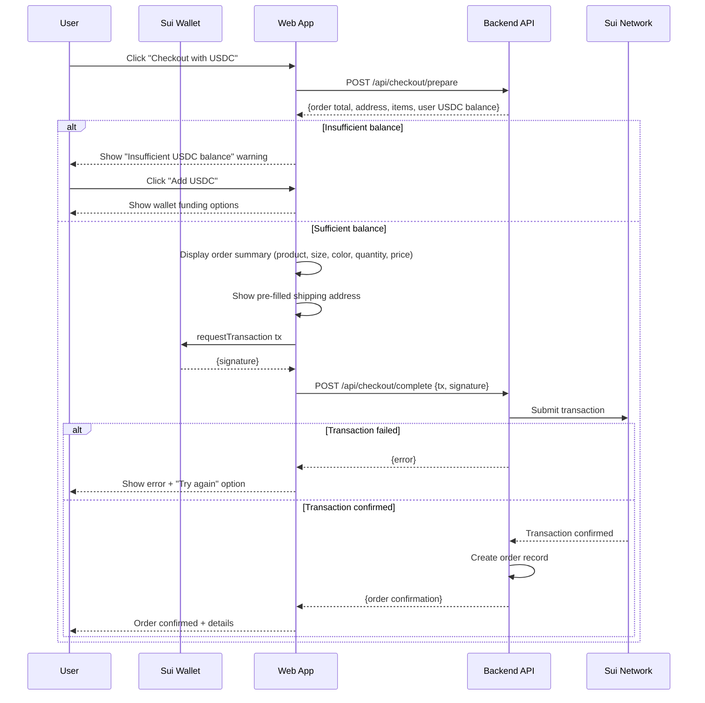
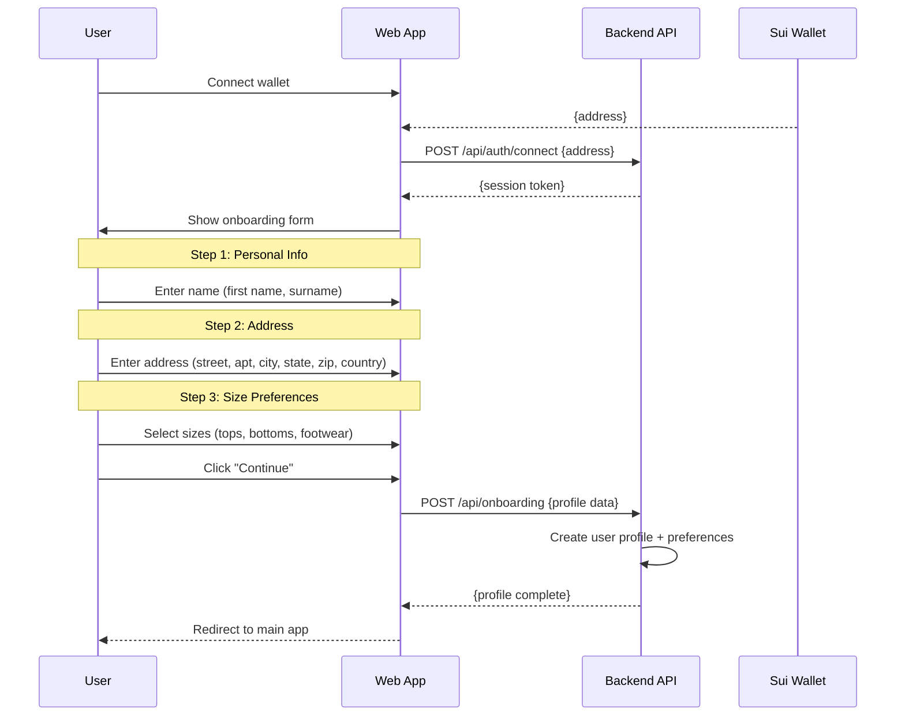

# AI Shopping Assistant - System Design

This document contains system architecture diagrams, sequence diagrams, and technical specifications for the AI Shopping Assistant project.

---

## Table of Contents

1. [Mission](#1-mission)
2. [Design Principles](#2-design-principles)
3. [Tech Stack](#3-tech-stack)
4. [Architecture](#4-architecture)
5. [External Dependencies](#5-external-dependencies)
6. [Cross-Cutting Concerns](#6-cross-cutting-concerns)
7. [Constraints](#7-constraints)
8. [Open Points](#8-open-points)
9. [Related Documents](#9-related-documents)

---

## 1. Mission

**Mission:** Build an AI-powered shopping assistant that enables users to discover products through conversational chat, complete purchases with USDC cryptocurrency, and manage their shopping profile with a seamless mobile-first experience.

**Who it serves:**
- Cryptocurrency-native shoppers who prefer crypto payments
- Online shoppers who want personalized AI-assisted product discovery
- Mobile-first users who expect app-like web experiences

**Why it exists:**
- Bridge the gap between Web2 e-commerce and Web3 payments
- Reduce friction in product discovery with AI-powered conversational search
- Enable seamless crypto payments for everyday e-commerce

---

## 2. Design Principles

| Principle | Rationale |
|-----------|-----------|
| **Web-first, crypto-native** | Prioritize web experience; treat crypto as native payment method, not an afterthought |
| **Conversational over search** | AI chat is the primary discovery mechanism; traditional search is secondary |
| **Minimal onboarding** | Capture only essential data (sizes, address) upfront; defer profile completion |
| **Trust through transparency** | Show wallet balance, transaction status, and order details clearly |
| **Fail gracefully on-chain** | Blockchain transactions can fail; provide clear retry paths |
| **Mobile-optimized** | Design for thumb-friendly interactions; prioritize mobile UX |

---

## 3. Tech Stack

| Layer | Technology | Notes |
|-------|------------|-------|
| **Frontend Framework** | Next.js 14 | App Router, Server Components |
| **UI Library** | React 18 | Component-based UI |
| **Styling** | Tailwind CSS | Utility-first CSS |
| **State Management** | Zustand | Lightweight client state |
| **Blockchain** | Sui | Native USDC support |
| **Wallet SDK** | @mysten/wallet-adapter | Multi-wallet support |
| **AI/LLM** | OpenAI GPT-4 | Conversational product search |
| **Database** | PostgreSQL | User data, orders, addresses |
| **Cache** | Redis | Session, cart caching |
| **Analytics** | PostHog | Product analytics |
| **Error Tracking** | Sentry | Frontend/backend errors |
| **Hosting** | Vercel | Edge deployment |
| **Object Storage** | AWS S3 | Product images, assets |

---

## 4. Architecture

### 4.1 High-Level System Overview



### 4.2 Client vs Backend Responsibilities



### 4.3 Component Details

#### Web Application (Client)

| Component | Responsibility | Dependencies |
|-----------|---------------|--------------|
| **Next.js App** | Routing, SSR, page layout | React, Tailwind |
| **Wallet Adapter** | Connect/disconnect wallets, tx signing | @mysten/wallet-adapter |
| **AI Chat UI** | Chat messages, product cards, suggestions | Zustand (state) |
| **Cart UI** | Cart drawer, quantity controls | Zustand (state) |
| **Checkout UI** | Order summary, address selection, tx confirm | Wallet Adapter |

#### Backend API

| Component | Responsibility | Dependencies |
|-----------|---------------|--------------|
| **Auth Service** | Wallet-based authentication, session | PostgreSQL, JWT |
| **Cart Service** | Cart CRUD, merge guest/cart | Redis, PostgreSQL |
| **Order Service** | Order creation, lifecycle, history | PostgreSQL, Sui SDK |
| **AI Search Service** | LLM orchestration, product matching | OpenAI, Product API |
| **Profile Service** | User preferences, addresses | PostgreSQL |

### 4.4 User Flows

#### Address Management Flow



#### Cart Management Flow



#### Order History Flow



#### AI Product Search Flow



#### Checkout Flow



#### Onboarding Flow



**Onboarding Form Fields:**

| Step | Field | Type | Required |
|------|-------|------|----------|
| Personal | First Name | text | Yes |
| Personal | Surname | text | Yes |
| Address | Street Address | text | Yes |
| Address | Apt/Suite | text | No |
| Address | City | text | Yes |
| Address | State/Province | text | No |
| Address | ZIP/Postal Code | text | Yes |
| Address | Country | dropdown | Yes |
| Sizes | Tops | select (XXS-XXL) | Yes |
| Sizes | Bottoms | select (26-38) | Yes |
| Sizes | Footwear | select (5-13) | Yes |

### 4.5 Data Model

```mermaid
erDiagram
    User ||--o{ Address : has
    User ||--o{ Order : places
    User ||--o| Cart : has
    User ||--o| UserPreferences : has
    Cart ||--o{ CartItem : contains
    Order ||--o{ OrderItem : contains
    Order ||--|| Address : ships_to

    User {
        string id PK
        string wallet_address UK
        string username
        string email
        string purch_token_balance
        timestamp created_at
        timestamp updated_at
    }

    Address {
        string id PK
        string user_id FK
        string first_name
        string last_name
        string country
        string street
        string apt
        string city
        string state
        string zip
        boolean is_default
        timestamp created_at
    }

    UserPreferences {
        string id PK
        string user_id FK
        string tops_size
        string bottoms_size
        string footwear_size
        timestamp updated_at
    }

    Cart {
        string id PK
        string user_id FK
        timestamp updated_at
    }

    CartItem {
        string id PK
        string cart_id FK
        string product_id
        string product_name
        string product_image
        decimal price
        string size
        string color
        int quantity
    }

    Order {
        string id PK
        string user_id FK
        string address_id FK
        enum status ["pending", "confirmed", "processing", "shipped", "delivered", "cancelled"]
        decimal total
        string tx_hash
        timestamp created_at
    }

    OrderItem {
        string id PK
        string order_id FK
        string product_id
        string product_name
        string product_image
        decimal price
        string size
        string color
        int quantity
    }
```

### 4.6 API Architecture

```mermaid
graph TB
    subgraph "API Routes"
        AUTH[/api/auth/*]
        CHAT[/api/chat/*]
        CART[/api/cart/*]
        ORDER[/api/order/*]
        PROFILE[/api/profile/*]
        ADDRESS[/api/address/*]
    end

    subgraph "Middleware"
        AUTH_MW[Auth Middleware]
        RATE_LIM[Rate Limiter]
        VALIDATE[Request Validator]
    end

    subgraph "Services"
        AUTH_SVC[Auth Service]
        CHAT_SVC[Chat Service]
        CART_SVC[Cart Service]
        ORDER_SVC[Order Service]
        PROFILE_SVC[Profile Service]
    end

    subgraph "Data"
        DB[(PostgreSQL)]
        CACHE[(Redis)]
    end

    AUTH --> AUTH_MW
    CHAT --> AUTH_MW
    CART --> AUTH_MW
    ORDER --> AUTH_MW
    PROFILE --> AUTH_MW

    AUTH_MW --> RATE_LIM
    RATE_LIM --> VALIDATE
    VALIDATE --> AUTH_SVC
    VALIDATE --> CHAT_SVC
    VALIDATE --> CART_SVC
    VALIDATE --> ORDER_SVC
    VALIDATE --> PROFILE_SVC

    AUTH_SVC --> DB
    CHAT_SVC --> DB
    CHAT_SVC --> CACHE
    CART_SVC --> DB
    CART_SVC --> CACHE
    ORDER_SVC --> DB
    PROFILE_SVC --> DB
```

---

## 5. External Dependencies

| Service | Purpose | Failure Behavior |
|---------|---------|-----------------|
| **Sui Network** | Blockchain tx processing | Show error, allow retry; queue for retry on network congestion |
| **USDC Token** | Primary payment | Check balance before checkout; show insufficient funds |
| **OpenAI GPT-4** | AI conversational search | Fallback to keyword search; show "AI unavailable" message |
| **Product Data API** | Product listings | Cache results; show limited results if unavailable |
| **Wallet Providers** | User wallet connection | Support multiple wallets; fallback to QR code |
| **PostHog** | Analytics | Fail silently; don't block user flows |
| **Sentry** | Error tracking | Fail silently; don't block user flows |

---

## 6. Cross-Cutting Concerns

### 6.1 Security

| Concern | Implementation |
|---------|---------------|
| **Authentication** | Wallet-based auth using Sui address; JWT tokens with short expiry |
| **Authorization** | User can only access their own cart, orders, addresses |
| **Input Validation** | Zod schema validation on all API routes |
| **Rate Limiting** | 100 req/min per IP; stricter limits on write operations |
| **Sensitive Data** | Wallet addresses are public; no PII without encryption at rest |
| **Transaction Signing** | All blockchain txs signed client-side; backend never holds keys |

**Known Gaps:**
- No 2FA for account recovery (future feature)
- No IP allowlisting (future feature)

### 6.2 Data Architecture

| Domain | Storage | Lifecycle |
|--------|---------|-----------|
| User profiles | PostgreSQL | Permanent |
| Addresses | PostgreSQL | User-managed, permanent |
| Orders | PostgreSQL | Permanent, audit trail |
| Cart | Redis | 30-day TTL, merge on login |
| Chat history | PostgreSQL | User-managed delete |
| Sessions | Redis | 24-hour TTL |

### 6.3 Observability

| Tool | Purpose |
|------|---------|
| **Sentry** | Error tracking (frontend + backend) |
| **PostHog** | Product analytics, funnels |
| **Vercel Analytics** | Performance monitoring |
| **Sui Explorer** | Transaction debugging |

### 6.4 Performance and Scalability

| Target | Metric |
|--------|--------|
| **Page Load** | LCP < 2.5s |
| **AI Response** | First token < 3s |
| **Checkout Flow** | Complete < 60s |
| **API Latency** | p95 < 500ms |

**Bottlenecks:**
- AI search latency depends on LLM response time
- Product API may be rate-limited
- Blockchain confirmation times vary

### 6.5 Error Handling

| Scenario | Behavior |
|----------|----------|
| Wallet not connected | Show connect prompt; disable checkout |
| Insufficient USDC | Show warning; suggest add funds |
| Transaction failed | Show error; offer retry |
| AI unavailable | Fallback to keyword search |
| Network offline | Show offline indicator; queue actions |

---

## 7. Constraints

### 7.1 Technical Constraints

- **Platform:** Web-based only (no native mobile apps in v1)
- **Blockchain:** Sui network only (no multi-chain in v1)
- **Payment:** USDC only (no fiat in v1)
- **Authentication:** Wallet-based only (no email/password in v1)

### 7.2 Business Constraints

- **Team Size:** 2-4 engineers
- **Timeline:** Q2 2026 launch
- **Budget:** Minimize external API costs

### 7.3 Regulatory Constraints

- **KYC:** May require based on transaction volumes
- **Crypto Compliance:** Must comply with local regulations

---

## 8. Open Points

| Point | Context | Options |
|-------|---------|---------|
| **Product Data Provider** | Where do product listings come from? | (A) Affiliate networks (Amazon Associates), (B) Direct retailer APIs, (C) Product aggregators |
| **LLM Provider** | Which AI model for chat? | (A) OpenAI GPT-4, (B) Anthropic Claude, (C) Self-hosted open-source |
| **Payment Flow** | How to handle USDC payments? | (A) Direct transfer to platform wallet, (B) Payment protocol (e.g., MoonPay bridge) |
| **Merchant Account** | How does the platform earn? | (A) Affiliate commissions, (B) Transaction fee, (C) Premium subscriptions |
| **Chat History Storage** | Where to store conversations? | (A) PostgreSQL, (B) Vector DB for AI context, (C) Client-only |

---

## 9. Related Documents

| Document | Path |
|----------|------|
| PRD | `docs/PRD.md` |
| API Specs | `docs/api/` (to be created) |
| Feature Specs | `docs/specs/` (to be created) |

---

*Document created: March 9, 2026*
*Last updated: March 9, 2026 (updated with Purch.xyz feature discovery)*
